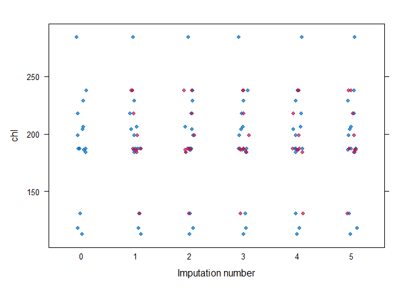

<!-- README.md is generated from README.Rmd. Please edit that file -->

# futuremice

<!-- badges: start -->

[](https://lifecycle.r-lib.org/articles/stages.html#experimental)
[](https://CRAN.R-project.org/package=futuremice)
[](https://codecov.io/gh/jesse-smith/futuremice)
[](https://github.com/jesse-smith/futuremice/actions/workflows/R-CMD-check.yaml)
<!-- badges: end -->

NOTE: This package is an unfinished experiment in extending `{mice}` and is no longer updated or maintained. `{mice}` now supports using `{future}` for parallelization, so you're probably better off using that.

`{futuremice}` parallelizes the main functionality of the `{mice}`
package using `{future}` and `{furrr}`. This enables the use of a
progress bar for updates, as well as an early stopping method to save
time spent on unneeded iteration or manual convergence checks (not
quality checks - you still have to assess the results yourself).

## Installation

You can install the development version of futuremice like so:

``` r
# You will need Rtools to install packages from Github on Windows
# `devtools` with throw an informative error if Rtools is not found
if (!"devtools" %in% installed.packages()) install.packages("devtools")
devtools::install_github("jesse-smith/futuremice")
```

## Minimal Example

Let’s run the example from the `{mice}` package documentation, but in
parallel.

``` r
# Load {futuremice}
library(futuremice)

# Use a local seed
withr::local_seed(1L)

# Evaluate futures in parallel - max of two workers to avoid hogging resources
future::plan("multisession", workers = pmin(2L, future::availableCores()))

# Use {progress} package for progress bar - shows diagnostics in real time
progressr::handlers("progress")
```

`{futuremice}` uses the `{future}` package to run imputations in
parallel. By default, `{future}` will run a `"sequential"` plan, which
is no different (and a little less efficient) than calling
`mice::mice()`. To take advantage of multiple CPUs, we can use a
`"multisession"` plan (see the
[vignette](https://future.futureverse.org/articles/future-1-overview.html#controlling-how-futures-are-resolved)
from the `{future}` package for details on different plans).
`future_mice()` also provides a progress bar and real-time convergence
diagnostics using `{progressr}`; however, the default progress bar does
not show messages, so we’ll use the `progress` handler to see our
diagnostics.

Now, let’s impute our missing data:

``` r
# Impute the missing values using defaults
# Use `progressr::with_progress()` to show the progress bar
mids <- progressr::with_progress(future_mice(mice::nhanes))
#> Converged in 58 iterations
#> R-hat: 1.036/1.022/1.021/1.033

# Or start with `mice::mice()` and finish with `future_mids()`
mids2 <- mice::mice(mice::nhanes, maxit = 1L, printFlag = FALSE)
mids2 <- progressr::with_progress(future_mids(mids2, maxit = 100L))
#> Converged in 68 iterations
#> R-hat: 1.035/1.021/1.025/1.017/1.023

# View the resulting `mids` (*m*ultiply *i*mputed *d*ata *s*et) object
mids
#> Class: mids
#> Number of multiple imputations:  5 
#> Imputation methods:
#>   age   bmi   hyp   chl 
#>    "" "pmm" "pmm" "pmm" 
#> PredictorMatrix:
#>     age bmi hyp chl
#> age   0   1   1   1
#> bmi   1   0   1   1
#> hyp   1   1   0   1
#> chl   1   1   1   0

# List the actual imputations for BMI
mids$imp$bmi
#>       1    2    3    4    5
#> 1  30.1 30.1 30.1 30.1 30.1
#> 3  30.1 30.1 30.1 30.1 30.1
#> 4  28.7 28.7 28.7 28.7 28.7
#> 6  21.7 21.7 21.7 21.7 21.7
#> 10 20.4 20.4 20.4 20.4 20.4
#> 11 27.2 27.2 27.2 27.2 27.2
#> 12 27.4 27.4 27.4 27.4 27.4
#> 16 30.1 30.1 30.1 30.1 30.1
#> 21 27.2 27.2 27.2 27.2 27.2
```

Note that `future_mice()` will often run longer than `mice::mice()`’s
default of `5` imputations before convergence is confidently achieved.
Also note that we will only get a progress bar if we wrap the call in
`with_progress()`; this is a feature of the `{progressr}` package.

We can use the resulting `mids` object just like the result of a call to
`mice::mice()`. Let’s inspect the quality of the imputations:

``` r
# Inspect quality of imputations
mice::stripplot(mids, chl, pch = 19, xlab = "Imputation number")
```



In general, we would like the imputations to be plausible, i.e., values
that could have been observed if they had not been missing. Now let’s
fit a model to the imputed data set and pool the results:

``` r
# Fit complete-data model
fit <- with(mids, lm(chl ~ age + bmi))

# Pool and summarize the results
summary(mice::pool(fit))
#>          term   estimate std.error  statistic       df     p.value
#> 1 (Intercept) -21.865304 56.857847 -0.3845609 20.23797 0.704574068
#> 2         age  27.399468  8.579227  3.1936989 20.23797 0.004512915
#> 3         bmi   6.237545  1.812132  3.4421031 20.23797 0.002544689
```

The complete-data model is fit to each imputed data set, and the results
are combined to arrive at estimates that properly account for the
missing data.

We can also compare two `mids` objects using `compare_mids()`:

``` r
compare_mids(mids, mids2, ignore_rng = TRUE)
#> Elements of `x` not in `y`
#> ✔ None
#> Elements of `y` not in `x`
#> ✔ None
#> Shared elements with differences:
#> ✖ iteration
#> ✖ chainMean
#> ✖ chainVar
#> Shared elements without differences:
#> ✔ data
#> ✔ imp
#> ✔ m
#> ✔ where
#> ✔ blocks
#> ✔ nmis
#> ✔ method
#> ✔ predictorMatrix
#> ✔ visitSequence
#> ✔ formulas
#> ✔ post
#> ✔ blots
#> ✔ ignore
#> Shared elements ignored:
#> ℹ call
#> ℹ seed
#> ℹ lastSeedValue
#> ℹ loggedEvents
#> ℹ version
#> ℹ date
```

This will show us where differences occur between the two objects (if
there are any). We’ll ignore attributes that depend on the RNG state
because evaluating imputations in parallel requires a different kind of
random number generation than evaluating sequentially, as we did in the
first iteration of `mice::mice()`.

## Code of Conduct

Please note that the futuremice project is released with a [Contributor
Code of
Conduct](https://contributor-covenant.org/version/2/0/CODE_OF_CONDUCT.html).
By contributing to this project, you agree to abide by its terms.
